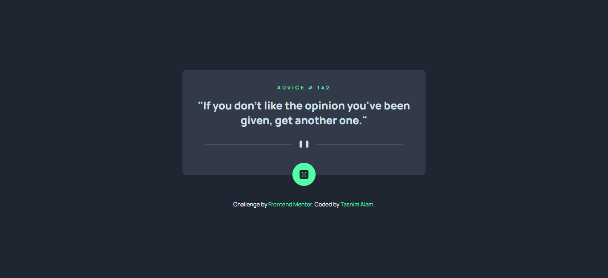
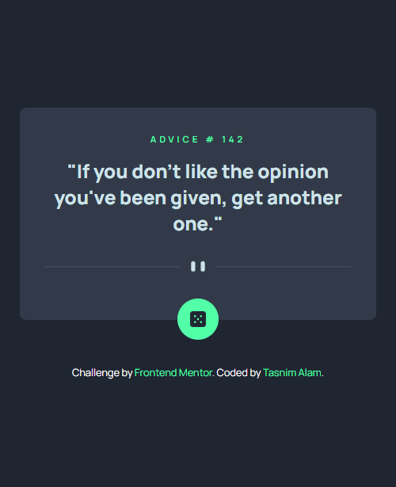

# Frontend Mentor - Advice generator app solution

This is a solution to the [Advice generator app challenge on Frontend Mentor](https://www.frontendmentor.io/challenges/advice-generator-app-QdUG-13db). Frontend Mentor challenges help you improve your coding skills by building realistic projects.

## Table of contents

- [Overview](#overview)
  - [The challenge](#the-challenge)
  - [Screenshot](#screenshot)
  - [Links](#links)
- [My process](#my-process)
  - [Built with](#built-with)
  - [What I learned](#what-i-learned)
- [Author](#author)

## Overview


### The challenge

Users should be able to:

- View the optimal layout for the app depending on their device's screen size
- See hover states for all interactive elements on the page
- Generate a new piece of advice by clicking the dice icon

### Screenshot




### Links

- Solution URL: [Repository]()
- Live Site URL: [Live Preview]()

## My process

### Built with

- Semantic HTML5 markup
- Flexbox
- CSS Grid
- Fetch API

### What I learned

````html
<picture>
  <source
    media="(min-width: 500px)"
    srcset="images/pattern-divider-desktop.svg"
  />
  <source
    media="(max-width: 501px)"
    srcset="images/pattern-divider-mobile.svg"
  />
  
</picture>
````

```js
fetch("https://api.adviceslip.com/advice")
  .then((response) => response.json())
  .then((data) => {
    adviceID.textContent = `ADVICE # ${data.slip.id}`;
    advice.textContent = `"${data.slip.advice}"`;
  });

dice.addEventListener("click", newAdvice);

function newAdvice() {
  fetch("https://api.adviceslip.com/advice")
    .then((response) => response.json())
    .then((data) => {
      adviceID.textContent = `ADVICE # ${data.slip.id}`;
      advice.textContent = `"${data.slip.advice}"`;
    });
}

```

## Author
- Website - [Tasnim Alam](https://github.com/Tasnim005)
- Frontend Mentor - [Tasnim005](https://www.frontendmentor.io/profile/Tasnim005)

