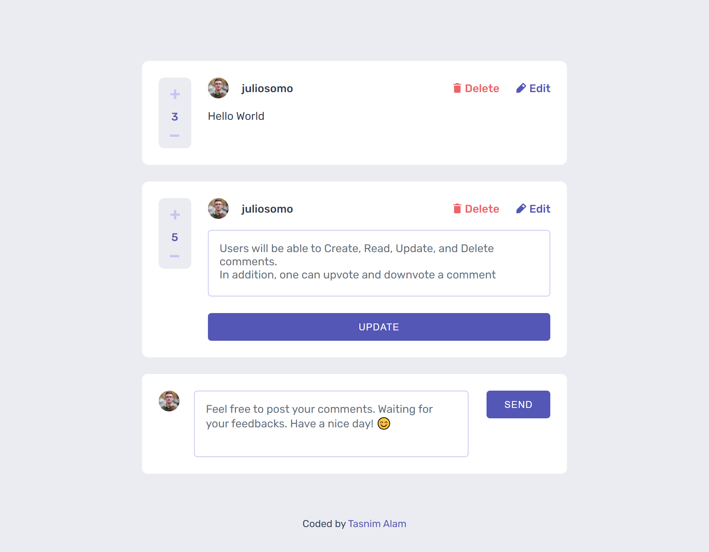
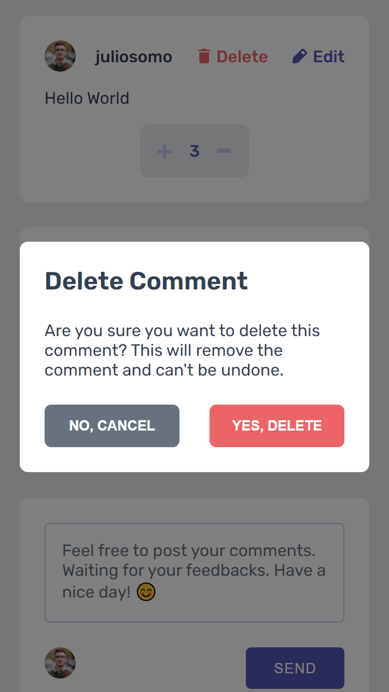

# CRUD App

A CRUD (Create, Read, Update, Delete) application is a common type of application that allows users to perform basic operations on a set of data

## Table of contents

- [Overview](#overview)
  - [Features](#features)
  - [Screenshot](#screenshot)
  - [Links](#links)
- [My process](#my-process)
  - [Built with](#built-with)
  - [What I learned](#what-i-learned)
- [Author](#author)

## Overview

### Features

Users should be able to:

- View the optimal layout for the app depending on their device's screen size
- See hover states for all interactive elements on the page
- Create, Read, Update, and Delete comments and replies
- Upvote and downvote comments

### Screenshot




### Links

- Solution URL: [Repository](https://github.com/Tasnim005/CRUD-App/)
- Live Site URL: [Live Preview](https://tasnim005.github.io/CRUD-App/)

## My process

### Built with

- Semantic HTML5 markup
- CSS custom properties
- Flexbox
- CSS Grid

### What I learned
I laerned how to build counter with JS

```js
const counter = document.createElement("div");

const upvote = document.createElement("img");
upvote.setAttribute("src", "images/icon-plus.svg");

const downvote = document.createElement("img");
downvote.setAttribute("src", "images/icon-minus.svg");

const rating = document.createElement("p");
rating.textContent = 0;

counter.append(upvote);
counter.append(rating);
counter.append(downvote);

let score = 0;

upvote.addEventListener("click", () => {
  score++;
  updateCounter();
});
downvote.addEventListener("click", () => {
  score--;
  updateCounter();
});

function updateCounter() {
  rating.textContent = score;
}
```
Besides, Update functionality was quite challenging

## Author

- Website - [Tasnim Alam](https://github.com/Tasnim005)
- Frontend Mentor - [Tasnim005](https://www.frontendmentor.io/profile/Tasnim005)
- Instagram - [tasnim005\_](https://www.instagram.com/tasnim005_/)
